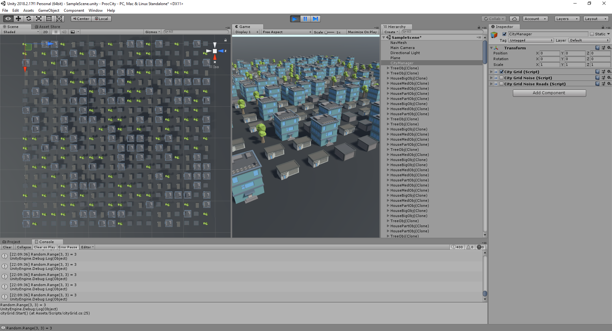
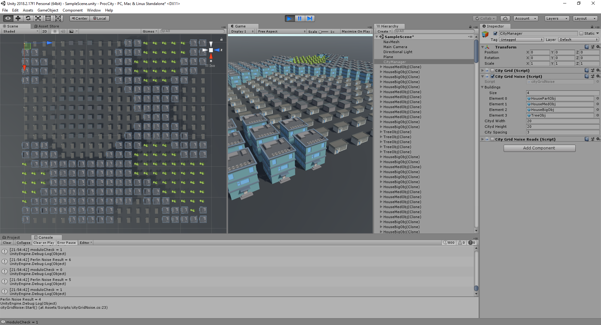
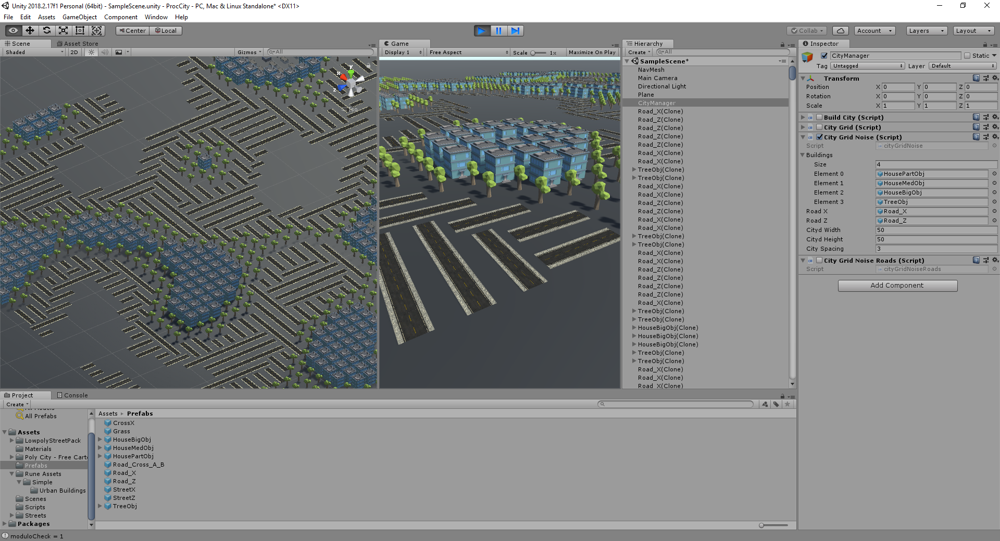
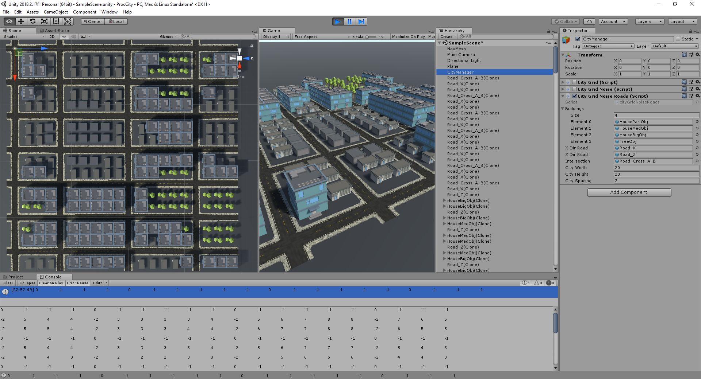

This past weekend I had some time to explore game development. City building is one of my favorite genres, so I looked into it and decided to experiment with a procedurally generated city. While there are a lot of basic tutorials out there, nothing really matched what I had in mind, so I got into the mathematics of procedural generation and game engine documentation. I choose to use the Unity game engine because of readily available documentation and ease of scripting with C#.

As an aside, I also explored Unreal Engine, but most learning resources tended to use blueprints, which I found a bit cumbersome for this task; but the implementation tended to be the same: generate a grid or spline system. I will probably attempt a more thorough investigation at a later date.

Note: I'm assuming a basic familiarity with Unity and will not go into details about Unity specific classes and functions.

Some essential references from the Unity documentation:

- [Instantiating Prefabs](https://docs.unity3d.com/Manual/InstantiatingPrefabs.html)
- [Game Objects](https://docs.unity3d.com/ScriptReference/GameObject.html)
- [Perlin Noise](https://docs.unity3d.com/ScriptReference/Mathf.PerlinNoise.html)

Credits for the 3D models used:

- Buildings/trees from [Poly City - Free Cartoon Pack](https://assetstore.unity.com/packages/3d/poly-city-free-cartoon-pack-95242) by [Wand and Circles](https://assetstore.unity.com/publishers/26567)
- Roads from [Low Poly Street Pack](https://assetstore.unity.com/packages/3d/environments/urban/low-poly-street-pack-67475) by [Dynamic Art](https://assetstore.unity.com/publishers/21977)

---

## Method of Random Generation: Grids

First off, I'll briefly explain the reasoning behind the code.

Just to mention it: one common approach is to randomly generate splines and attach objects to the spline, but this is a bit more complex and I didn't have the time to pursue that path.

So while there are many approaches to take, the simplest one which I settled for was to generate a world grid then populate that grid with randomized elements. In terms of code, this involves generating a 2D array and populating it with random values.

This is what it looks like:

```csharp
// Generate City
for (int h = 0; h < Height; h++)
{
  for(int w = 0; w < Width; w++)
  {
    // ... Randomized Content ...
  }
}
```

## The Basic Grid and Assets

Using any assets, even geometric primitives such as cubes or spheres, an array of `GameObjects[]` can be created to use in populating the code. In my case I used some free assets I came across in the Unity Asset Store (see above) to make the screenshots look more interesting. When using imported assets, it is important to setup the scales to match the buildings and roads.

Extrapolating from the basic grid structure discussed previously, a nested for-loop is used to generate the "City Grid".

While this gives the basic grid pattern, everything will be placed on a single point rather than an area, so to overcome this, the generated instance `Vector3 pos` can be slightly enlarged with a spacing modifier. The value of this spacing depends on the relative scale of the assets and is fine tuned with trial and error.

The code becomes as follows:

```csharp
using UnityEngine;
using System.Collections;

public class buildCity : MonoBehaviour
{
    public GameObject[] cityAssets; // Array for building assets
    public int citydWidth = 10;
    public int citydHeight = 10;
    public int citySpacing = 2; // Dependent on assets and scales

    void Start ()
    {
        // City Grid
        for (int h=0; h < citydHeight; h++)
        {
            for (int w=0; w < citydWidth; w++)
            {
                // Grid position to insert building asset
                Vector3 pos = new Vector3(w * citySpacing, 0, h * citySpacing);
                // Generating a random number from 0 to array length of cityAssets
                int i = Random.Range(0, cityAssets.Length);
                // Instantiating a randomly selected building from the cityAssets array
                Instantiate(cityAssets[i], pos, Quaternion.identity);
            }
        }
    }
}
```

This yields the following:



## Adding Random Noise

The above code produces a basic randomized grid city, but it is too random... Real cities have some kind of plan and designated zones for low and high rise areas as well as parks. So to emulate this, I added noise to the generated blocks. (I found a good tutorial about noise [here](https://catlikecoding.com/unity/tutorials/noise/), but it was more for textures than anything else.)

There are several approaches to doing this including making your own custom noise function using the `Random` class of C#. However, to save time, I've used the Unity built-in function for Perlin noise, part of the Mathf struct: `Mathf.PerlinNoise`. My information was found from the [Unity documentation](https://docs.unity3d.com/ScriptReference/Mathf.PerlinNoise.html) and Wikipedia for a more general discussion of [Perlin Noise](https://en.wikipedia.org/wiki/Perlin_noise). The Perlin Noise function essentially acts as a height map of sorts where a higher value corresponds to a more "dense" (in the urban sense- higher buildings) than a lower value.

The `PerlinNoise()` function takes two inputs: an x and y coordinate. For my use case, this is the grid coordinates of the city (width and height). Upon first use, I didn't find any variation because, as I read later, large input values produce a constant result for the Perlin Noise function. Through some trial and error, I found that the key was to make the input values of width and height small enough that a noticeable variation is achieved in the topography of the city. The sweet spot was dividing the with and height by 10 to achieve the desired results.

The Perlin Noise function results are `float` types by default and in order to make the divisions easier to work with, I multiply by a factor of 10 and cast the result to an `int` type. This does cause a great deal of truncation, but I do not see it being a factor for the city grid generation because a city is rendered on a very large scale. Where truncation might be an issue is for generation smaller scale or precision work such as textures generation.

Following the setup of the `PerlinNoise()` function, the variation steps of the function results need to be segregated such that a "zoned" city will appear when simulated. Although I'm sure this can be achieved programmatically, due to the limited time I simply manually tuned the parameter by running the output in the Unity Engine console:

```csharp
Debug.Log("Perlin Noise Result = " + resultNoise.ToString());
```

From the console output, I selected my divisions and choose my assets accordingly.

The final code with noise was as follows:

```csharp
using System.Collections;
using System.Collections.Generic;
using UnityEngine;

public class cityGridNoise : MonoBehaviour
{
    public GameObject[] cityAssets; // Array for building assets
    public int citydWidth = 20;
    public int citydHeight = 20;
    public int citySpacing = 2; // Dependent on assets and scales

    void Start()
    {
        // City Grid
        for (int h = 0; h < citydHeight; h++)
        {
            for (int w = 0; w < citydWidth; w++)
            {
                // Multiply result by 10 for easier zoning divisions
                int resultNoise = (int)(Mathf.PerlinNoise(w / 10.0f, h / 10.0f) * 10);
                Vector3 pos = new Vector3(w * citySpacing, 0, h * citySpacing);

                // Divide noise results into specific assets to achieve 'city zoning' effect
                if (resultNoise < 1)
                {
                    Instantiate(cityAssets[0], pos, Quaternion.identity);
                }
                else if (resultNoise < 2)
                {
                    Instantiate(cityAssets[1], pos, Quaternion.identity);
                }
                else if (resultNoise < 3)
                {
                    Instantiate(cityAssets[2], pos, Quaternion.identity);
                }
                else if (resultNoise < 4)
                {
                    Instantiate(cityAssets[3], pos, Quaternion.identity);
                }
            }
        }
    }
}

```

The city should now display with a zoning-like effect:


## Adding roads

The next challenge was adding roads. I spent a lot of time thinking about this. How do I possibly get roads to align with buildings when each point is randomly assigned? I first tried to mess around with the aforementioned Perlin Noise result divisions/zoning, but wound up with non-sensical spaghetti roads.

How not to make roads:



Upon looking at my grid, and Google Maps, I realized I needed a grid within a grid: Gridception!
So the easiest way I could think of was to generate the Perlin Noise in a 2D array then modify that array in certain rows and columns to have indicators for roads.

This took a bit of exploring 2D arrays in C#:

1. First, an array of random integers was created to emulate the results from the Perlin Noise function.
2. Then rows at fixed intervals were modified to represent streets in the horizontal direction of the city grid, taking a value of "-".
3. Finally, columns along the city grid were modified to represent streets in the vertical direction, taking value of "&#124;" nominally, or if a horizontal direction was detected then modifying it to a "+" to represent an intersection.

Here is the very simple array manipulation C# script (non-Unity; generic C# .NET console application in VisualStudio):

```csharp
using System;
using System.Collections.Generic;
using System.Linq;
using System.Text;
using System.Threading.Tasks;

namespace csArrayManip
{
    class Program
    {
        static void Main(string[] args)
        {
            string[,] arr = new string[10, 10]; // Initialize a string array
            Random rnd = new Random(); // Initialize a Random type variable

            int rowLength = arr.GetLength(0);
            int colLength = arr.GetLength(1);

            for (int i = 0; i < rowLength; i++)
            {
                for (int j = 0; j < colLength; j++)
                {
                    // Generate random numbers as strings to populate the array
                    arr[i, j] = rnd.Next(1, 6).ToString();
                }
            }

            Console.Write(string.Format("Original Array:") + Environment.NewLine);
            Print2DArray(arr);

            // Modify the Row-direction
            int row = 0;
            for (int i = 0; i < rowLength; i++)
            {
                for (int j = 0; j < colLength; j++)
                {
                    arr[row, j] = "-";
                }
                // Increment to another row at random intervals within the range
                row += rnd.Next(3, 4);
                if (row >= rowLength) break;
            }

            Console.Write(string.Format("Row-Modified Array:") + Environment.NewLine);
            Print2DArray(arr);

            // Modify the Column-direction
            int col = 0;
            for (int i = 0; i < rowLength; i++)
            {
                for (int j = 0; j < colLength; j++)
                {
                    // Checks if previously assigned "-" value
                    if (arr[j, col] == "-")
                    {
                        // If true, an "intersection" is created as value "+"
                        arr[j, col] = "+";
                    }
                    else
                    {
                        // Otherwise, create a column value of "|" (pipe)
                        arr[j, col] = "|";
                    }
                }
                // Increment to another column at random intervals within the range
                col += rnd.Next(4, 8);
                if (col >= colLength) break;
            }

            Console.Write(string.Format("Column-Modified Array:") + Environment.NewLine);
            Print2DArray(arr);

            Console.ReadLine();
        }

        /// Prints out a 2D array.
        public static void Print2DArray<ary>(ary[,] arg)
        {
            int rowLength = arg.GetLength(0);
            int colLength = arg.GetLength(1);

            for (int i = 0; i < rowLength; i++)
            {
                for (int j = 0; j < colLength; j++)
                {
                    Console.Write(arg[i, j] + "\t");
                }
                Console.Write(Environment.NewLine);
            }
            Console.Write(Environment.NewLine);
        }
    }
}

```

Here is the output of the console application:

]

Getting back to Unity, the previous array manipulation was implemented purely with integers because it is far easier to quickly manipulate than strings. Instead of dashes, pipes and pluses, negative numbers outside the range of the Perlin Noise result function were used.

After some refactoring, the summary of changes are as follows:

- Added 3 new `GameObjects`: X-Direction Roads, Z-Direction Roads and Intersections
- Added a City Grid 2D array of integers to store initial Perlin Noise function results
- Added modifier methods to add roads in X and Z directions or intersections
- City generation refactored to an asset assignment method

The complete refactored and final Unity script now looks like this:

```csharp
using System.Collections;
using System.Collections.Generic;
using UnityEngine;

public class cityGridNoiseRoads : MonoBehaviour
{
    public GameObject[] cityAssets;
    public GameObject xDirRoad;
    public GameObject zDirRoad;
    public GameObject intersection;

    public int cityWidth = 20;
    public int cityHeight = 20;
    public int citySpacing = 2; // Dependent on assets and scales

    int[,] cityGrid;

    void Start()
    {
        cityGrid = new int[cityWidth, cityHeight];

        // Generate Initial Layout
        for (int h = 0; h < cityHeight; h++)
        {
            for (int w = 0; w < cityWidth; w++)
            {
              // Add some random variation to the Perlin Noise generation
              wRand = w + Random.Range(0, 3);
              hRand = h + Random.Range(0, 3);

              // Generate the Perlin Noise value for a point on the grid
              cityGrid[w, h] = (int)(Mathf.PerlinNoise(wRand / 10.0f, hRand / 10.0f) * 10);
            }
        }

        // Modify Grid Layout to Add Roads in Rows (Unity Z-direction)
        int row = 0;
        // Note that the Height and Width are reversed to call rows in order
        for (int w = 0; w < cityWidth; w++)
        {
            for (int h = 0; h < cityHeight; h++)
            {
                // Assign a z-direction road
                cityGrid[row, h] = -1;
            }
            // Increment to another row at random intervals within the range
            row += Random.Range(3, 4);
            if (row >= cityWidth) break;
        }

        // Modify Grid Layout to Add Roads in Columns (Unity X-Direction)
        int col = 0;
        for (int h = 0; h < cityHeight; h++)
        {
            for (int w = 0; w < cityWidth; w++)
            {
                //Check if previously assigned z-direction road exists
                if (cityGrid[w, col] == -1)
                {
                    // If ture, assign an intersection
                    cityGrid[w, col] = 0;
                }
                else
                {
                    // Otherwise, assign a x-directon road
                    cityGrid[w, col] = -2;
                }
            }
            // Increment to another column at random intervals within the range
            col += Random.Range(4, 8);
            if (col >= cityHeight) break;
        }

        // Generate City
        for (int h = 0; h < cityHeight; h++)
        {
            for (int w = 0; w < cityWidth; w++)
            {
                int assetAssign = cityGrid[w, h];
                Vector3 pos = new Vector3(w * citySpacing, 0, h * citySpacing);

                if (assetAssign == 0)
                {
                    // Display an intersection
                    Instantiate(intersection, pos, intersection.transform.rotation);
                }
                else if (assetAssign == -1)
                {
                    // Display a Z-direction road
                    Instantiate(zDirRoad, pos, zDirRoad.transform.rotation);
                }
                else if (assetAssign == -2)
                {
                    // Display a X-direction road
                    Instantiate(xDirRoad, pos, xDirRoad.transform.rotation);
                }
                // All other cityAssets below
                else if (assetAssign <= 2)
                {
                    Instantiate(cityAssets[0], pos, Quaternion.identity);
                }
                else if (assetAssign <= 4)
                {
                    Instantiate(cityAssets[1], pos, Quaternion.identity);
                }
                else if (assetAssign <= 6)
                {
                    Instantiate(cityAssets[2], pos, Quaternion.identity);
                }
                else if (assetAssign <= 8)
                {
                    Instantiate(cityAssets[3], pos, Quaternion.identity);
                }
            }
        }

        // Unity debug console output to test visual asset correlation with generated grid
        string arrStr = "";
        for (int i = 0; i < cityHeight; i++)
        {
            for (int j = 0; j < cityWidth; j++)
            {
                arrStr += string.Format(cityGrid[i, j] + "\t");
            }
            arrStr += System.Environment.NewLine + System.Environment.NewLine;
        }
        Debug.Log(arrStr);

    }
}

```

This script now generates this:



A debug log was added for reference. Note the correlation between the Z-axis (blue arrow) and X-axis (red arrow).

And that wraps up this fun little weekend adventure!
