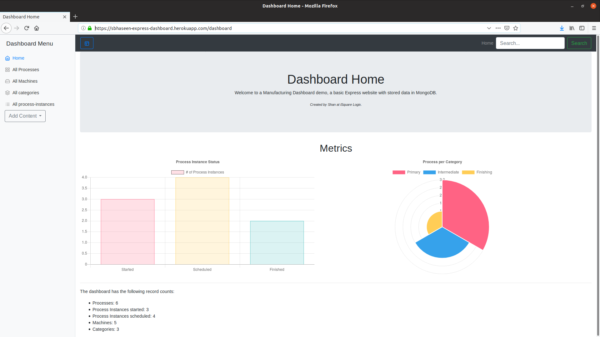

I put together an example web application to learn more about the process of creating dashboards as well Node.js, Express and MongoDB. MongoDB was chosen to gain familarity with it and the concepts of document collections. Express was chosen for it's simplicity and relatively light weight.

My Express dashboard demo repository can be found [here](https://github.com/sbhaseen/express-dashboard-demo).

Some good references that helped me develop this project:

- [Express.js - Guide](https://expressjs.com/en/guide/routing.html)
- [Mongoose ODM - Documentation](https://mongoosejs.com/docs/guide.html)
- [Handlebars.js - Expressions](https://handlebarsjs.com/expressions.html)
- [Chart.js - Documentation](https://www.chartjs.org/docs/latest/)

---

## Choosing the Components

I needed a light weight app that could easily be hosted anywhere.

Views were made with the templating engine Handlebars, which was chosen for it's similarity with HTML (as opposed to EJS) and good collection of helper functions, despite being logic-less. Bootstrap was used as a front end to speed up development.

This project had no special data requirements and a SQL database could have been used just as easily. However I'm already familar with PostgreSQL and decided to try a different technology. MongoDB was chosen to gain insight into using document collections in place of relational databases.

As a consequence of using MongoDB, the Mongoose ODM (Object Document Mapper) package was used to simplify data model generation by specifying model schemas. This made it easier to use queries and perform data validation, without having to worry about type casting and building logic hooks separately.

Lastly, Chart.js was chosen to visualize the data metrics becuase of it's easy integration as well as being JavaScript native.

## Data Model

A fictional manufacturing facility was developed to demonstrate dashboard functionality. The key thing being to highlight produciton processes. Thus, a relationship was made between Machine, Process, Process Instances and process Category. Although this data is largely made up, it is based on my experiences working in the engineering department of highly automated advanced manufacturing facilities for nealy a decade.

The app is designed with Models, Routes, Controllers and Views as seperately grouped code to be more modular and organized.

## Dashboard Design

A clean and simple dashboard design was desired, so some inspiration was taken from Bootstrap examples and mixed into my own take on a functional dashboard. The most challenging thing here was making a toggleable sidebar navigation. I chose to make a sidebar becuase many popular dashboard themes have this feature and it also helps to display funcitons and sections more conveniently than a top navigation bar.

In terms of page layout, the toggle required that two divs be made inherent to all pages. This was so that a client-side JavaScript function can be called when the toggel button is pressed. In essence, this places a "wrapper" class into the div (side bar, in this case) that is going to be toggled.

```html
<!-- HTML Wrapper Layouts -->
<div class="d-flex" id="wrapper">
  <!-- Sidebar -->
  <div class="bg-light border-right sidebar" id="sidebar-wrapper">...</div>
  <!-- /#sidebar-wrapper -->

  <!-- Page Content -->
  <div id="page-content-wrapper">...</div>
  <!-- /#page-content-wrapper -->
</div>
<!-- /#wrapper -->
```

The rest is accomplished by setting CSS styles to be applied when "wrapper" is toggled.

```css
/* Wrapper Margin Shrink */
#wrapper.toggled #sidebar-wrapper {
  margin-left: 0;
}
```

The function that made the toggle button for the sidebar was as follows:

```javascript
// Toggle button for sidebar
$("#menu-toggle").click(function (e) {
  e.preventDefault()
  $("#wrapper").toggleClass("toggled")
})
```

## Data Queries

Given that the model I used is relatively simple and has only a small number of collections, I didn't bother to create a seperate API back end. Rather, I opted to query directly within the app controller.

Some simple Mongoose queries are best demonstrated by the index page contoller logic. These are all asynchronous queries which will execute before the page render is called. The code, as follows:

```javascript
...
// Example Mongoose Queries
exports.index = function(req, res) {

  async.parallel({
      process_count: function(callback) {
          Process.countDocuments({}, callback);
      },
      process_instance_count: function(callback) {
          ProcessInstance.countDocuments({}, callback);
      },
      process_instance_scheduled_count: function(callback) {
          ProcessInstance.countDocuments({status:'Scheduled'}, callback);
      },

      ...

  }, function(err, results) {
      res.render('index', { title: 'Dashboard Home',
                            error: err,
                            data: results });
  });
};
...
```

Another important concept was the aggregation method becuase Process has ObjectID's of Category referenced. Thus to avoid using simple hard-coded ID queries and make the code more generalized, one must use aggregation in place of countDocuments. This will be as follows:

```javascript
...
// Example of aggregation
process_category_primary_count: function(callback) {
  Process.aggregate([
    {
      $lookup: {
        from: 'categories',
        localField: 'category',
        foreignField: '_id',
        as: 'category_id'
      }
    },
    { $unwind: '$category_id' },
    { $match: { 'category_id.name': 'Primary' } },
    { $group: { _id: null, count: { $sum: 1 } } },
  ], callback);
}
...
```

It is important to note that this aggregation look up query reults in an array of objects in the form:

```javascript
;[{ _id: null, count: 3 }]
```

Therefore any references made to this must perform slicing to obtain the exact count. An example of this is the call made in index.handlebars:

```handlebars

{{#each data.process_category_primary_count}}{{this.count}}{{/each}};

```

More advanced search functionality is available via regular expression, which is what I used for the search bar functionality. Some example code for this is as follows:

```javascript
...
// Mongoose Query with Regex
process_qs: function(callback) {
  Process.find({name: { $regex: '.*' + qs + '.*', $options: 'i' }})
  .populate('machine')
  .exec(callback);
},

...
```

## The Results

The dashboard is designed with data visualization in mind and displays the main metrics as soon as the home page is loaded.

Update: This project was formely hosted on Heroku, but is now archieved for reference code only.

A screenshot the dashboard home page:

