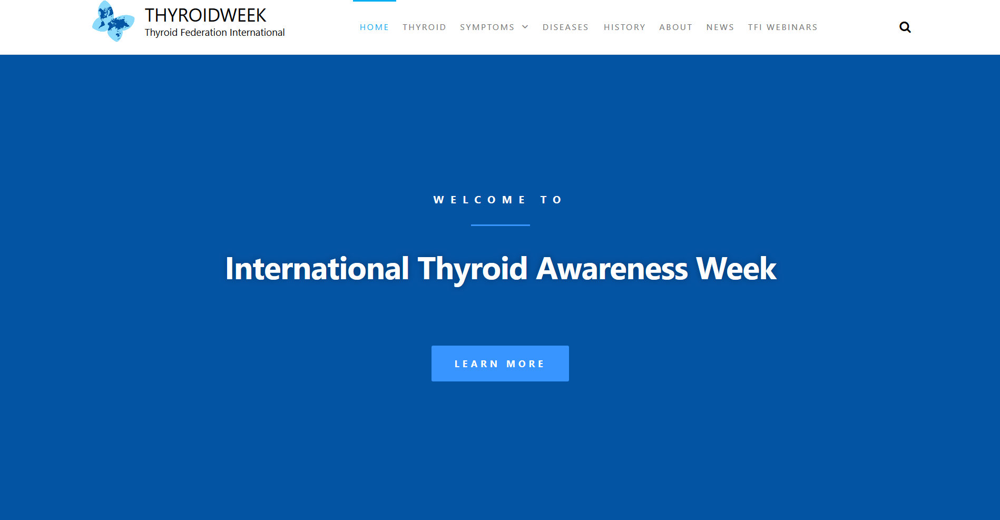
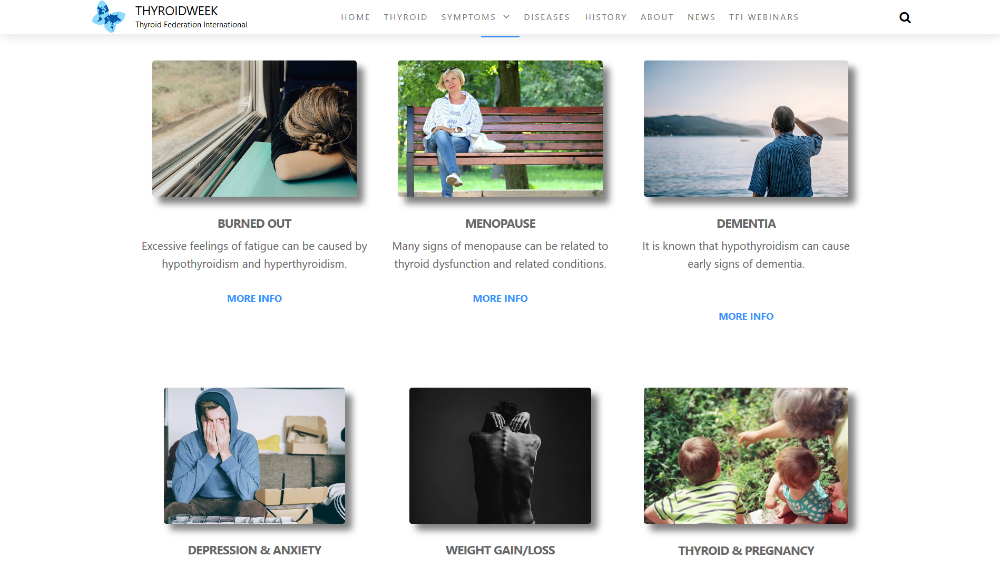

## Thyroidweek by Thyroid Federation International.

### [Visit Thyroidweek](https://thyroidweek.org/)

An informative website to raise awareness of thyroid diseases, commissioned by the patient outreach orginization [Thyroid Federation International](https://thyroid-fed.org/). The site was developed using WordPress as the client desired final editorial and content control enabled by the built-in CMS.

One important design consideration was to use a theme that looked good on mobile and desktop, but also preserved the content layout. Considering the client wanted to manage their own content after development, an easy to use graphical system was chosen: Elementor.

Some content was made to stand out by using a card-like system.

