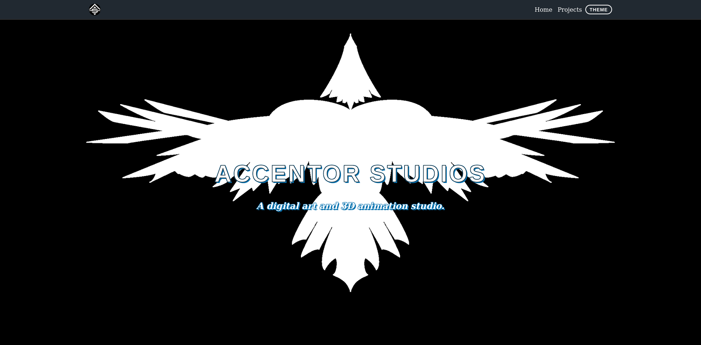
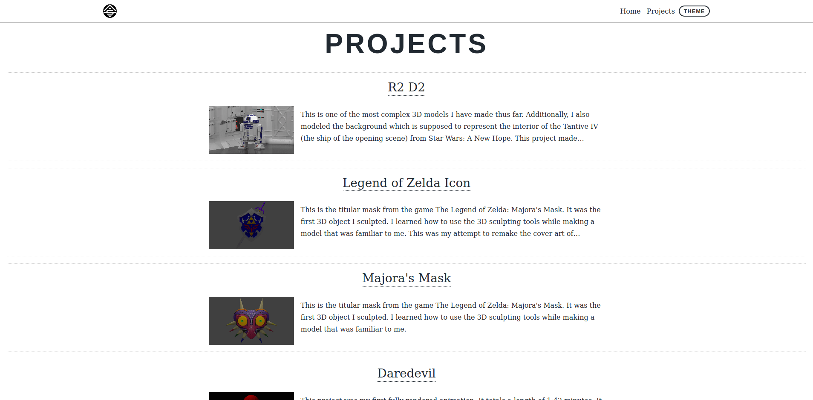
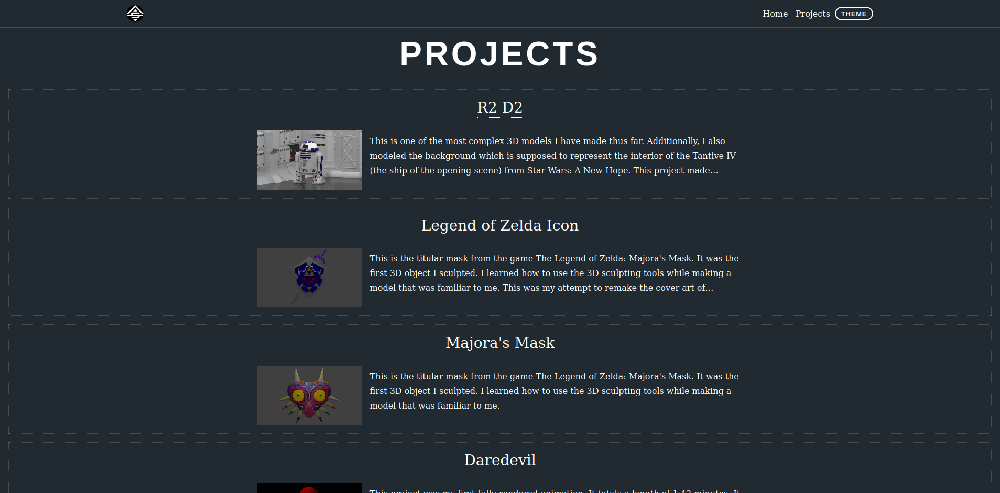

## Accentor Studios: A digital art and 3D animation studio.

#### [Visit Accentor Studios](https://www.accentorstudios.com/)

A business website to advertise the services and expertise of the customer. The site was developed using [Gastby](https://www.gatsbyjs.com/), a static site generator and framework built on top of React. Functional components and hooks were used across the project.

I worked closely with the owner to ensure that their custom styling and branding was used consistently throughout the site. Developing this site also led me to create custom HTML elements refernce pages to verify styling consistency across browsers.

The site was developed using a mobile-first approach and then adjusting for the larger area on desktop. Essentinal a media-query that was used to modify base styling for larger screens.

A request was made to have both a light and dark theme as shown in this screen shot. The theming was facilitated by using CSS variables and then toggling the class name of the root element. As an extra feature, script can auto-detect the client browser system preference for light or dark, if available. The selected theme choice can also be toggled by the user by clicking on the theme button.

